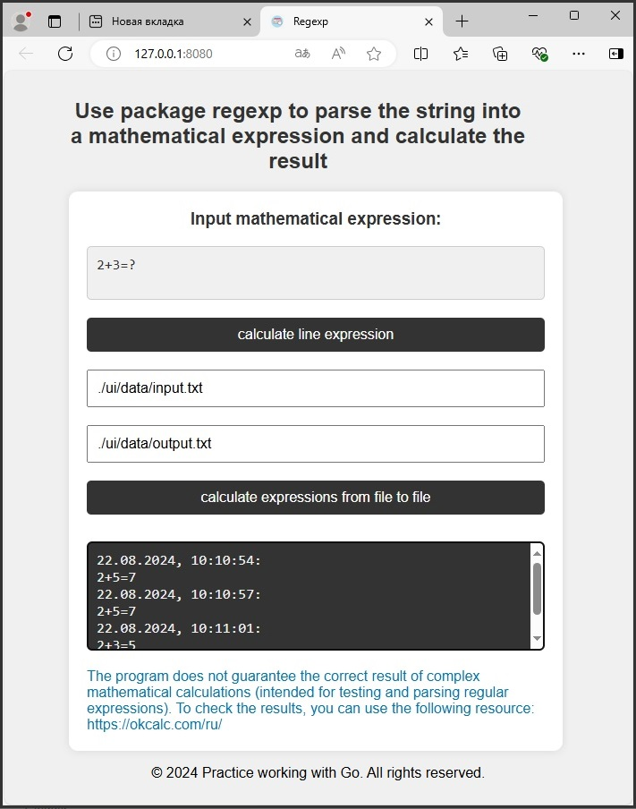

# Regexp + Go

<div align="center">
	
</div>


## Структура программы:

**1) Пакет "calcregexp" считывает из файла список математических выражений, считает результат и записывает в другой файл**<br>
***pkg\calcregexp\calcregexp.go***<br>
***pkg\calcregexp\calcregexp_test.go***<br>

Используя методы и структуры пакетов ioutils и regexp:
1) считывает из файла список математических выражений
2) считает результат
3) записывает в другой файл


Файлы со списком математических выражений:<br>
***./ui/data/input.txt***<br>
***./ui/data/input1.txt***<br>

**!!! Пакет "calcregexp" создан для тестовой работы с регулярными выражениями, это не полноценный математический парсер!!! Расчеты проверены на простых тестовых задачах в рамках задания!!!**

**2) Пакет "api" реализует характерную для REST API схему запросов для работы с БД.**<br>
***pkg\api\api.go***<br>
Запросы приходят на URL, соответствующий коллекции ресурсов:
- расчитать одно выражение "/expLine"
- расчитать из файла список математических выражений "/expFile"

Для обозначения действий над данными используются методы протокола HTTP: 
- POST для создания ресурса <br>
	api.router.HandleFunc("/expLine", api.addExpLineHandler).Methods(http.MethodPost, http.MethodOptions)<br>
	api.router.HandleFunc("/expFile", api.addExpFileHandler).Methods(http.MethodPost, http.MethodOptions)<br>

**3) Для визуализации и организации REST API схемы запросов используется HTML+Javascript:**<br>
***cmd\server\ui\html\base.html***<br>
***cmd\server\ui\html\routes.html***<br>

**4) Для регистрации ошибок создан пакет logger.**<br>
***pkg\logger\logger.go***<br>
***cmd\server\ui\data\log.json*** - файл для хранения сообщений<br> 


## Требования к системе:

Суть задания — написать программу, которая считывает из файла список математических выражений, считает результат и записывает в другой файл.

***Пример входного файла:***<br>
5+4=?<br>
9+3=?<br>
Сегодня прекрасная погода<br>
13+7=?<br>
4-2=?<br>

***Пример файла с выводом:***<br>
5+4=9<br>
9+3=12<br>
13+7=20<br>
4-2=2<br>

Пожелания к программе:
- Использовать методы и структуры пакетов ioutils и regexp.
- Программа должна принимать на вход 2 аргумента: имя входного файла и имя файла для вывода результатов.
- Если не найден вывод, создать.
- Если файл вывода существует, очистить перед записью новых результатов.
- Использовать буферизированную запись результатов.

Все выше перечисленные требования к системе учтены в проекте.
 

## Revision
 
- 1: package calcregexp


## Usage:

**1.Enter this command to start the program:**

**go run server.go -inpfile "./ui/data/input.txt" -outfile "./ui/data/output.txt"**

1) inpfile: This parameter is path to input data file.

2) outfile: This parameter is path to output data file.

**go run server.go**

defualt value (-inpfile "./ui/data/input.txt" -outfile "./ui/data/output.txt")


**2.Open the web browser and go to:**

```sh

http://127.0.0.1:8080/ or  localhost:8080

```

## Authors:

@PolinaSvet

**!!! It is for test now !!!**